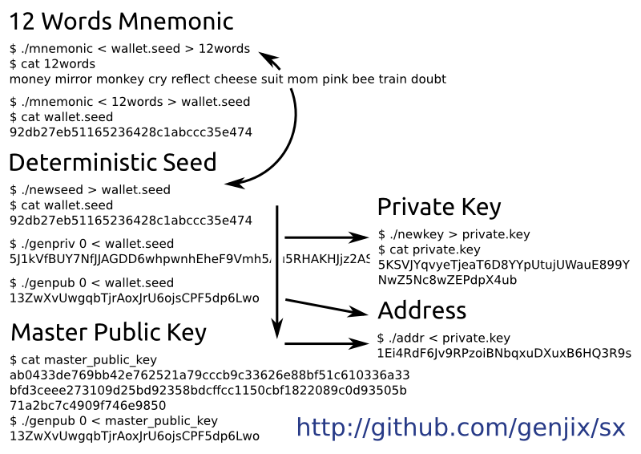

.. _tut-intro:

***************
Introduction
***************

My aim with this project is to provide a set of modular Bitcoin
commandline utilities, that admin types can engage with Bitcoin
functionality without having to write code.

By chaining all these commands together in different ways, you can do
offline transactions, maintain a wallet, work with deterministic keys, ...

It would be cool to see Bitcoin wallets written in bash script using
these tools to handle the core functionality. I believe the more we
give good tools to the community, the more we can decentralise
development and increase access to the core technology for all types.

Installation
============

Ubuntu/Debian
-------------

The simplest way to install sx, is to use the `install-sx.sh` bash script.
::

    $ wget http://sx.dyne.org/install-sx.sh
    $ sudo bash ./install-sx.sh

sx should now be installed.

ArchLinux
---------

ArchLinux users: https://aur.archlinux.org/packages/sx-git/

Cheatsheet
==========

Resources and Contact
=====================

Development repository:

  https://github.com/spesmilo/sx/

My Bitcoin address (from http://libbitcoin.dyne.org/):

    1Fufjpf9RM2aQsGedhSpbSCGRHrmLMJ7yY

Email: amir@unsystem.net

